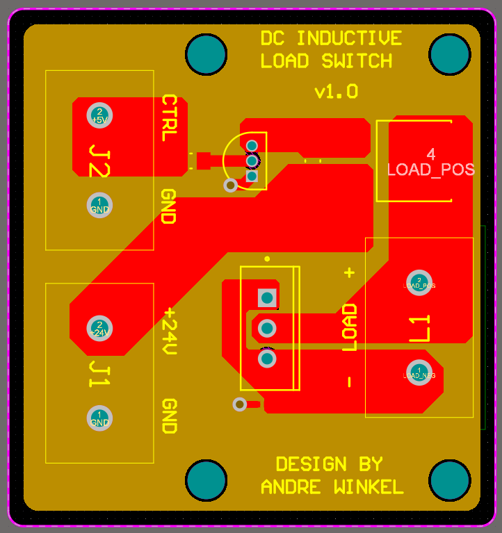
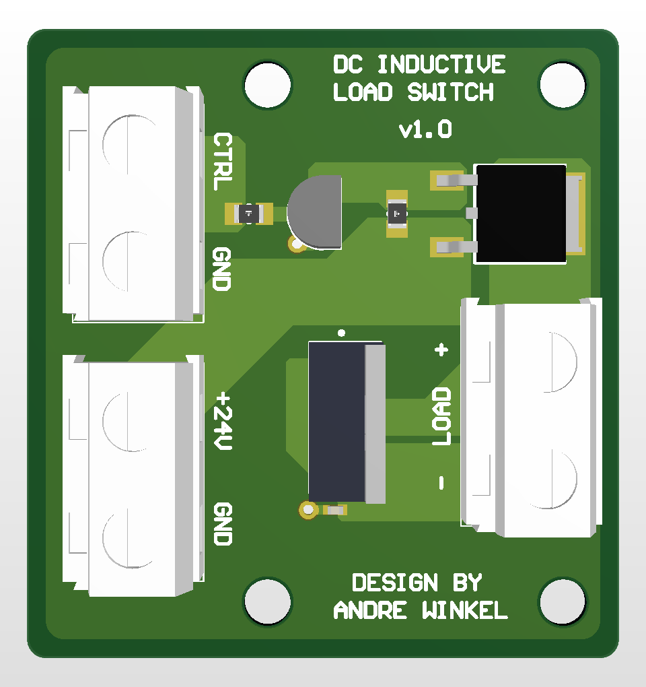
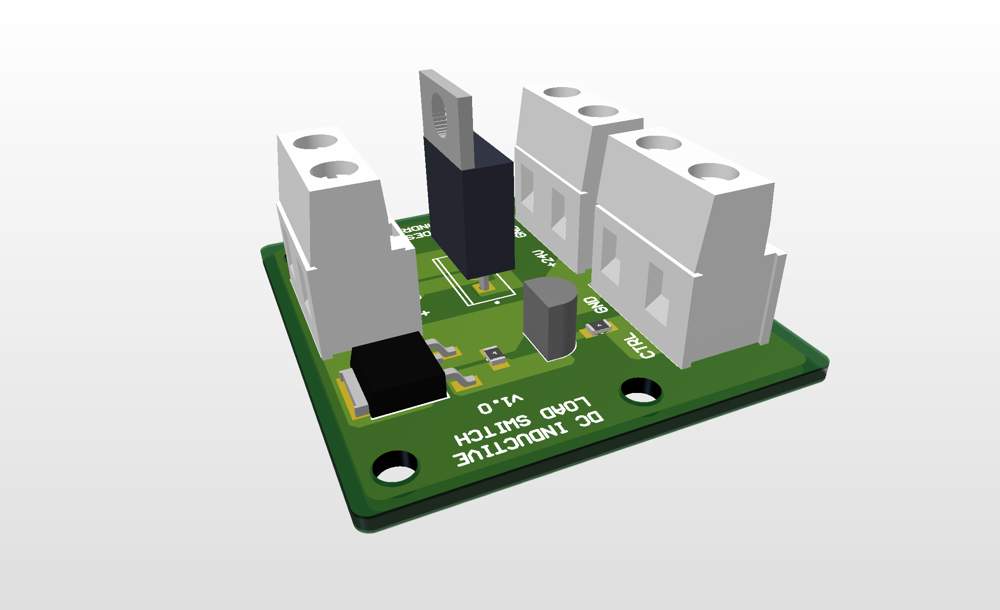

## DC Inductive Load Driver [PCB DESIGN]
This is a DC inductive load driver PCB, designed using Altium Designer. This PCB is designed to drive loads of up to 10A from a 24V supply, being primarily designed for 15mH ESL inductors. Additionally, this board takes in a 0-5V off-on control signal, and includes a high-efficiency P-channel enhancement-mode MOSFET [SQD19P06] in order to achieve ultra-high efficiency switching, and is rated for up to 60V 20A. This board also includes a Schottky diode rated for 100V, which is included to eliminate flyback across the inductor, having effectively instant reverse recovery. 

  
  
  

